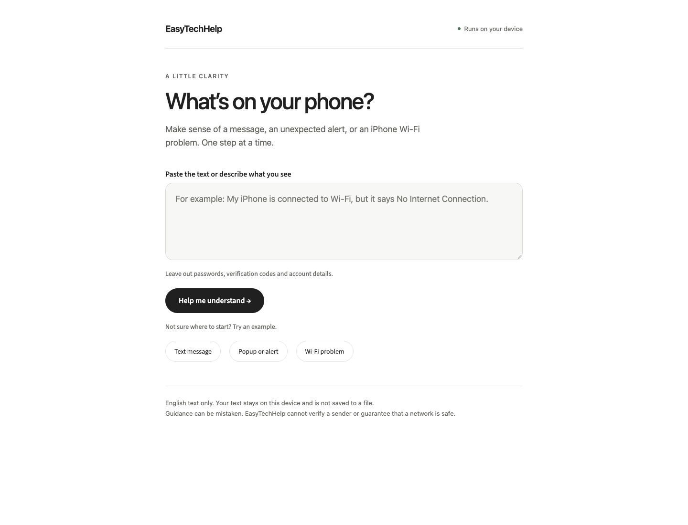

# EasyTechHelp

Local tech support for confusing messages, popups, and iPhone Wi-Fi problems.

## Why I built it

My grandmother lives alone. When something unfamiliar appears on her phone, explaining it over a call can be difficult. I built EasyTechHelp to help her understand what a message says, what deserves caution, and what she can do next. If she still needs help, she can copy a short summary to send to family.

The app accepts **English text**: paste a message or type what the phone shows. It runs a fine-tuned local model, looks up supporting information in local reference files, and uses code-defined rules to choose the next steps. It does not inspect screenshots or control the phone.



## What it handles

| Input | What the app checks |
| --- | --- |
| Text messages and email | Requests for passwords, verification codes, payment, or remote access; suspicious links and contact details |
| Popups and alerts | Browser virus warnings, support-number requests, installation prompts, and ordinary notifications |
| iPhone Wi-Fi descriptions | Wi-Fi off, Airplane Mode, password prompts, connected-but-no-internet states, and unsecured-network labels |

Results include a short explanation, cautions, next steps, actions to avoid, and source links. **Ask family for help** provides a summary that can be copied or downloaded. The app does not send it automatically.

## How it works

```text
English text
  → Qwen + trained LoRA adapter: category, signals, and input quotes
  → schema validation and application review
  → BM25 retrieval from local FTC articles and Apple-based summaries
  → local model selects a relevant source passage, or abstains
  → safety rules choose supported actions from a fixed catalog
  → explanation, next steps, sources, and optional family summary
```

The model generates structured observations. For explanations, it selects a passage from the retrieved material; the app displays the original wording. Next actions come from reviewed templates, with their supporting source text checked separately. This keeps model-generated instructions out of the action list.

| Part | Tools |
| --- | --- |
| Model | Qwen2.5-1.5B-Instruct |
| Fine-tuning and inference | PyTorch, Transformers, PEFT LoRA; MPS on the tested Mac, CPU fallback |
| Validation | Pydantic |
| Retrieval | Local document parsing and BM25; no vector database |
| Interface | Streamlit and CSS |
| Checks | pytest, Ruff, actual-model evaluations, browser interaction and accessibility checks |

See [architecture](docs/architecture.md) for the implementation details.

## Run locally

Tested on an M4 Mac with 16 GB memory. Use Python 3.11 or later and run these commands from the repository root.

### Install

```bash
python3 -m venv .venv
source .venv/bin/activate
python -m pip install -e '.[dev,training]'
```

### Download the model

The first download needs internet access and about 3.1 GB for the base weights. Later inference uses local files and needs no API key.

```bash
python - <<'PY'
from huggingface_hub import snapshot_download

snapshot_download(
    'Qwen/Qwen2.5-1.5B-Instruct',
    revision='989aa7980e4cf806f80c7fef2b1adb7bc71aa306',
    local_dir='artifacts/pytorch-model',
    allow_patterns=['*.json', '*.safetensors', 'merges.txt', 'vocab.json', 'LICENSE'],
)
PY
```

### Train the adapter

Weights are excluded from Git, so a fresh clone needs these two training runs. Skip this section if `artifacts/pytorch-adapter-v2` already contains a completed adapter. Training refuses to overwrite a nonempty output directory.

```bash
python -m easy_tech_help.training \
  --device mps \
  --output artifacts/pytorch-adapter

python -m easy_tech_help.training \
  --device mps \
  --init-adapter artifacts/pytorch-adapter \
  --output artifacts/pytorch-adapter-v2 \
  --epochs 3 \
  --learning-rate 0.00005 \
  --decision-weight 4 \
  --select-by-generation
```

Use `--device cpu` if MPS is unavailable; it will be slower. The app requires a completed adapter. Training settings and measured model results are in [the training report](results/improvement.md).

### Open the app

```bash
streamlit run app/app.py
```

Open the local URL printed in the terminal, usually `http://localhost:8501`.

Configuration is optional. [.env.example](.env.example) lists the model path, adapter path, and device. Copy it to `.env` only if you need different settings; `auto` chooses an available device. It is not an API-key file.

The app keeps results in the current session and does not write an input history or add submissions to training data. **Start a new check** clears the current input and result. Downloading a family summary saves the file only when requested.

### Command line

```bash
python -m easy_tech_help.guidance --file examples/message.txt
python -m easy_tech_help.guidance --file examples/popup.txt
python -m easy_tech_help.guidance --file examples/wifi.txt
python -m easy_tech_help.guidance --file examples/wifi.txt --family-summary
```

Normal CLI output includes diagnostic JSON and the original input. Use `--family-summary` for text intended to be shared. The `analysis`, `rag`, and `runtime` commands are debugging tools; `guidance` runs the complete product flow.

## Try these examples

These are synthetic examples, not messages collected from users.

**Text message** — expect a warning about sharing a verification code and advice to verify the request independently.

```text
Text message: This is customer support. Reply with the verification code you just received.
```

**Popup** — expect a source-check warning, advice to close the unfamiliar popup, and a reminder to avoid its phone number.

```text
A Safari popup says my iPhone has a virus and tells me to call a support number.
```

**Wi-Fi** — expect connection checks, including comparison with another device on the same known network.

```text
My iPhone is connected to Wi-Fi, but it says No Internet Connection.
```

An ordinary message such as `Text message from a friend: See you at the book club tomorrow.` should receive no specific warning. That result does not verify who sent it.

All three examples above were checked through the actual local app, including source links and the family summary. See [the final check](results/final_review.md).

## Data and sources

Training uses **200 labeled examples**: 120 synthetic records and 80 redacted messages from the public UCI SMS collection. The split is 132 training, 34 validation, and 34 regression examples. The public subset has 40 normal and 40 spam messages; “spam” is a source label, not a verified scam verdict. Only the correct structured answers are used as supervised targets.

**Wi-Fi and popup/alert training examples are synthetic. More real device text is needed for these categories.** Labels were reviewed by the assistant, not independently by domain experts. See the [data guide](data/text/README.md) and [SMS attribution](data/sources/uci_sms/README.md).

RAG reads **six original FTC HTML articles and four clearly labeled Apple-based summaries** from [knowledge/](knowledge/README.md). Source links let users open the official pages; the app does not visit those URLs during inference. User submissions and training examples are not part of the reference corpus.

## Evaluation

| Check | Latest recorded result |
| --- | ---: |
| Automated tests | 237 passed |
| Separately enabled actual-model smoke tests | 7/7 |
| Original authored product challenges, after fixes | 24/24 |
| Additional authored cases, after one further fix | 16/16 |
| Action, evidence, and handoff constraints | 70/70 |
| RAG development checks | 8/8 |
| Raw model exact observations on inspected regression data | 23/34 |
| Same observations after application corrections | 34/34 |

These examples have been inspected and used during development. The improved application score is **not** independent accuracy or evidence of better model weights. Raw model signal recall remains 15/22; the public-SMS subset still has missed signals before code corrections. [Full results and limitations](results/quality_improvement.md) include the original failures, fixes, latency, and browser checks.

```bash
python -m pytest -q
ruff check .
ruff format --check .
EASY_TECH_HELP_RUN_LIVE_TESTS=1 python -m pytest tests/test_analysis_live.py -q
python -m easy_tech_help.product_evaluation --device mps --output results/product_improved.json
python -m easy_tech_help.verification_evaluation --device mps --output results/verification.json
python -m easy_tech_help.rag_evaluation --device mps --output results/rag_quality_checks.json
```

## Limits

- English text only, up to 4,000 characters. Screenshots and other device platforms are outside this version.
- The app can miss a request or misread context. It cannot verify a sender, inspect a network, or guarantee safety.
- A quoted source can still be poorly matched. When there is no suitable passage, the app says so instead of providing an unsupported explanation.
- Remove passwords, verification codes, and personal details before submitting text. Share the family summary rather than diagnostic JSON.
- Independent contemporary data, real iPhone examples, and usability testing with older adults are still missing from the evaluation.

## Repository

| Path | Contents |
| --- | --- |
| `app/` | Streamlit interface, stylesheet, and local SVG tab icon |
| `src/easy_tech_help/` | Training, inference, retrieval, safety rules, and evaluation commands |
| `data/` | Labeled text, provenance, and evaluation fixtures |
| `knowledge/` | Local references and source catalog |
| `examples/` | Text files to try with the app or CLI |
| `tests/` | Automated checks |
| `results/` | Training records, evaluation reports, and UI previews |
| `artifacts/` | Local model weights and adapters; ignored by Git |
